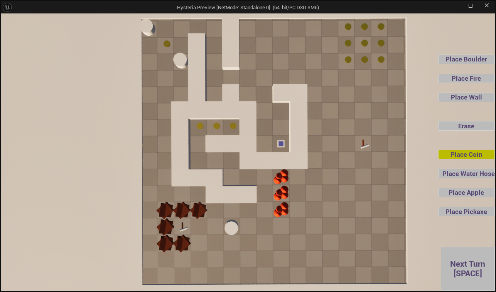
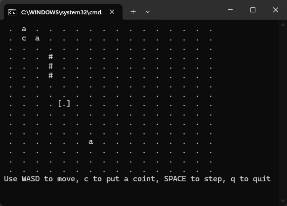

# Hysteria

**Hysteria** is a sandbox AI demo and simulation game.  
The player can dynamically modify a 3D world. Place obstacles, fire, items, and more. while observing agents trying to live their little lives and respond to your chaos.  
Agents strive to survive and avoid panic as the environment changes.

---

## Features

- [x] **Interactive grid world**
- [x] **Modify the world in real time:** Place boulders, walls, fire, and items
- [x] **Concurrent Multi-agent AI:** Agents plan and act based on current world state
- [x] **Undo/Erase mode**
- [x] **Step simulation:** Advance one turn at a time
- [x] **Clean, gray-boxed visuals (UE5)**
- [x] **A CLI (decoupled from UE5)**

### AI/Item System

- [x] **Boulders** – blocks paths
- [x] **Walls** – blocks paths (indestructable)
- [ ] **Fire** – panic agent, can be extinguished
- [ ] **Apple** – calms panicked agents
- [ ] **Pickaxe** – agents can destroy obstacles
- [x] **Coin** – motivates agents to pick it up
- [ ] **Water Hose** – extinguishes nearby fire on use

---

## Current Limitations / Known Issues

- Some items are not fully implemented (see unchecked boxes above).
- Simple visuals: gray-boxed for rapid prototyping and debugging.

*See [issues](https://github.com/Muffty/hysteria/issues) for details or to report bugs.*

---

## Try It Out

### CLI Version
- Build with CMake:
mkdir build
cd build
cmake ..
make
./HysteriaCLI

*(Requires C++17 and CMake)*

### Unreal Engine 5.6 Demo
- Open the project in UE5.6+
- Hit Play!
- Use the buttons to modify the world, then advance the simulation with `[SPACE]`.

---

## Controls

- **Mouse:** Select and place items/walls/etc.
- **Sidebar:** Pick element to place or advance turn

---

## Project Structure

- `Source/CoreAI/` – C++ template core (engine-agnostic, also used for CLI)
- `Source/Hysteria/` – UE5-specific logic and actors
- `CLI/` – Command-line demo

---

## About

**Hysteria** is an AI/tech demo by [your name], built to experiment with multi-agent planning, real-time decision making, and player-induced chaos.  
Indie dev, AI researcher, and system design nerd.

---

*Screenshot from current Unreal Engine build.  
See [issues](https://github.com/yourname/hysteria/issues) for progress and planned features.*